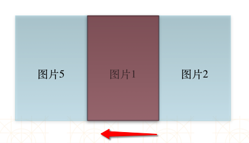
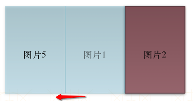
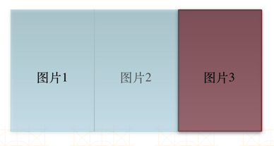
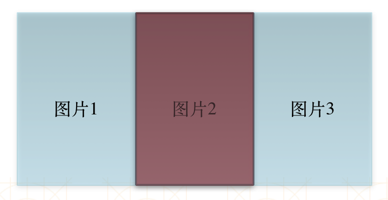

# TPCPageScrollView
UIScrollView+UIPageControl
## 核心步骤
- 在图片显示完全（endDecelerating）时，重新设置三个UIImageView的图片内容
- 调整UIScrollView的偏移量，始终显示中间的UIImageView

如有图片1、2、3、4、5，默认存放图片5、1、2，显示中间图片1:
1. 向后滚动，显示图片2

2. 图片显示完全时，重新设置UIImageView中的图片为图片1、2、3

3. 设置UIScrollView的偏移量，使其显示中间的UIImageView，即图片2

4. 向后滚动，显示图片3

5. 图片显示完全时，重新设置UIImageView中的图片为图片2、3、4

6. 设置UIScrollView的偏移量，使其显示中间的UIImageView，即图片3

向前滚动同理。

如下图所示：
- 初始时显示图片1，然后向左滑动

- 滑动完成时显示的是图片2

- 在滑动完成时，修改UIImageView显示的内容如下图所示

- 接着上一步，立即修改UIScrollView的偏移量，使其显示中间的UIImageView，即图片2

如上，最终结果显示的都是最中间的UIImageView，看起来像是无限个UIImageView一样
